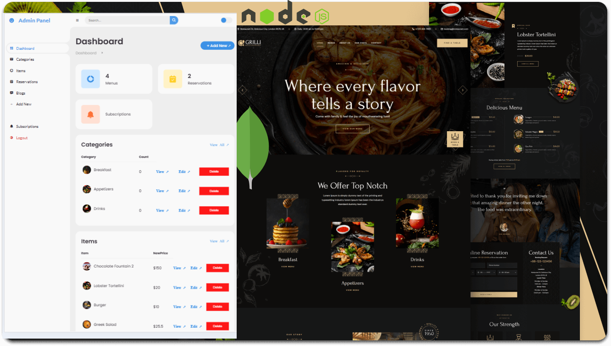

<div align="center">
  
  

  <br />
  <br />

  <h2 align="center">Foodie - Restaurant Website</h2>

Foodie is a fully responsive restaurant website. It is designed to work seamlessly across all devices and was built using HTML, CSS, and JavaScript. The project was then adapted into **EJS** for dynamic rendering and integrated with **Node.js**, **Express**, and **MongoDB** for the backend.

**Special thanks to the original creators whose frontend templates were used as the foundation for this project:**

- **Grilli Restaurant Website** by [CodeWithSadee](https://github.com/codewithsadee/grilli) (used as inspiration for the main website layout).

</div>

<br />

### Demo Screenshots



### Prerequisites

Before you begin, ensure you have met the following requirements:

- [Git](https://git-scm.com/downloads "Download Git") must be installed on your operating system.
- [Node.js](https://nodejs.org/) (for backend)
- [MongoDB](https://www.mongodb.com/) (for database)

### Run Locally

To run **Foodie** locally, clone the repository and install dependencies:

```bash
git clone https://github.com/UgohP/foodie.git
cd foodie
npm install
```

Run the application:

```bash
npm start
```

### Contact

Feel free to reach out to me on [Twitter](https://www.x.com/pasky_u) for any questions or feedback.
